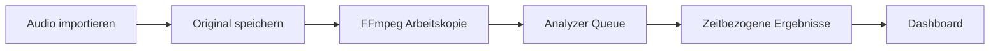

# Audio Workbench v0.2, Entwurf

## Ziel des ersten Prototyps

Eine lokale Ablage und Analyseoberfläche für fertige Audioaufnahmen. Die
Aufnahme selbst kommt zunächst von einem Diktiergerät, Smartphone, Google
Recorder oder einer Smartwatch. Die Workbench importiert die Datei und macht
danach sichtbar, was die Analyzer daraus ableiten.



## Bewusste Grenzen

- kein Recorder in v0.1
- kein Internetzugriff und keine externe API
- keine Benutzerverwaltung
- die Energie-VAD bleibt als Fallback aktiv; Silero VAD kann als optionales
  sherpa-onnx-Modul zugeschaltet werden
- ASR, Diarisierung/Speaker-ID, YAMNet, DCASE, BirdNET und Source Separation
  sind getrennte Erweiterungspunkte im Dashboard

## Benutzerfluss

1. Datei auf die Importfläche ziehen.
2. Die Datei wird unter einer neuen Recording-ID unverändert abgelegt.
3. FFmpeg erzeugt eine mono, 16 kHz, 16-bit PCM-WAV-Arbeitskopie.
4. Die konfigurierten Analyzer werden nacheinander ausgeführt.
5. Die Oberfläche aktualisiert Status und Ergebnisse automatisch.
6. Klicks auf Timeline oder Sprachbereich springen in der Arbeitskopie an die
   passende Stelle.

## Datenmodell

Eine Aufnahme ist das Primärobjekt. Analyseergebnisse hängen nicht an einer
besonderen UI-Kachel, sondern an `recording_id` und `analyzer_id`.

| Objekt | Wichtige Felder |
|---|---|
| Recording | ID, Originalname, Originalpfad, Arbeitskopie, Dauer, Sample-Rate, Status |
| Job | Recording-ID, Analyzer-ID, Status, Fortschritt, Fehlermeldung |
| Result | Recording-ID, Analyzer-ID, Result-Typ, JSON-Payload |
| Event | `start`, `end`, `label`, `confidence` in der jeweiligen Payload |

Das erlaubt später ein gemeinsames Zeitraster für Transkript, Sprecher,
Vogelstimme, Geräusch, Pegel und räumliche Richtung.

## Analyzer-Vertrag

Ein Analyzer erhält nur den Pfad zur normalisierten Arbeitskopie und liefert
ein JSON-kompatibles Ergebnis zurück:

```python
def analyze(path: Path) -> dict:
    return {
        "type": "timeline",
        "events": [
            {"start": 12.4, "end": 15.8, "label": "bird", "confidence": 0.91}
        ],
    }
```

Für die nächste Iteration können dadurch `transcription`, `diarization`,
`audio_tagging`, `birdnet` und `spatial_audio` ergänzt werden, ohne das
Aufnahme- oder Dashboard-Modell umzubauen.

Die optionalen Adapter in `analyzers/` laden schwere runtimes lazy. Ein
falsch oder noch nicht installiertes Modell legt deshalb nicht den gesamten
Importdienst lahm; der einzelne Job wird mit einer erklärbaren Fehlermeldung
beendet. Das ist die gewünschte Kapselung für Pi, N100 und spätere stärkere
Worker.

## Nächster sinnvoller Schritt

Als erstes echtes ML-Plugin sollte Silero VAD die Energie-Baseline ersetzen.
Danach kommt ein kleiner ASR-Analyzer, der die VAD-Bereiche als Eingangsfenster
verwendet und Text mit Zeitstempeln schreibt. Die Diarisierung hängt an den
Sprachsegmenten, die Speaker-Embeddings werden zusätzlich global über mehrere
Aufnahmen geclustert. Sobald Pi und stärkerer Rechner dieselbe Queue bedienen,
werden API und Worker als getrennte Prozesse betrieben.
